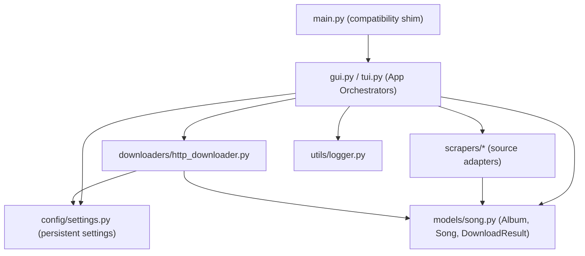
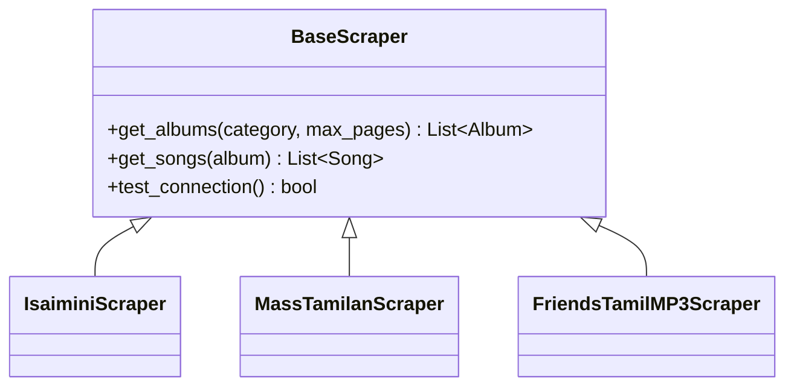
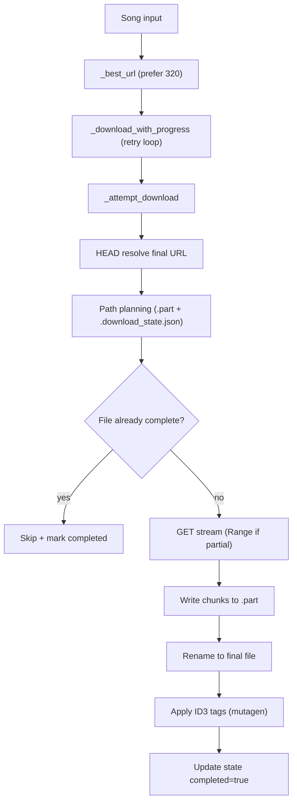
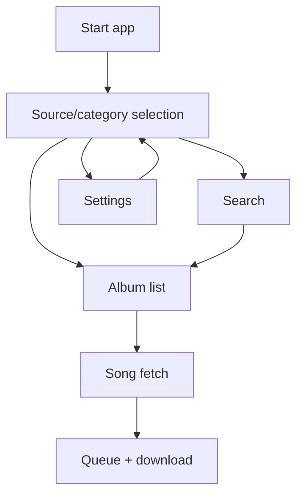
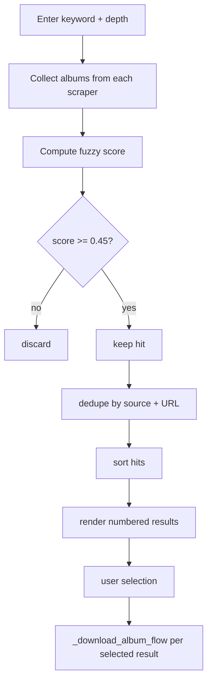
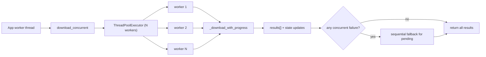
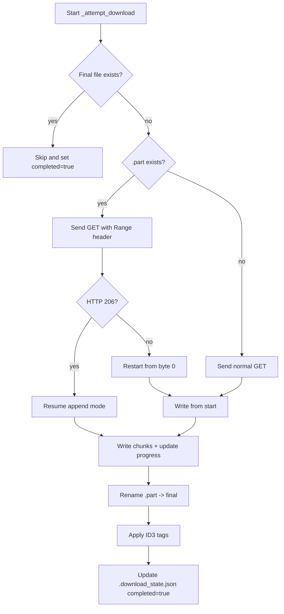

# Architecture

This document describes the current architecture of the Tamil MP3 Downloader codebase.

## Current Folder Structure

```text
tamil-mp3-downloader/
|-- gui.py
|-- tui.py
|-- main.py
|-- requirements.txt
|-- VERSION
|-- README.md
|-- CHANGELOG.md
|-- config/
|   |-- __init__.py
|   |-- settings.py
|   `-- settings.json
|-- models/
|   |-- __init__.py
|   `-- song.py
|-- scrapers/
|   |-- __init__.py
|   |-- base.py
|   |-- isaimini.py
|   |-- masstamilan.py
|   `-- friendstamilmp3.py
|-- downloaders/
|   |-- __init__.py
|   |-- base.py
|   `-- http_downloader.py
|-- utils/
|   `-- logger.py
|-- scripts/
|   |-- build_exe.bat
|   |-- run_all.sh
|   |-- check_masstamilan.py
|   |-- check_masstamilan_playwright.py
|   |-- probe_masstamilan.py
|   `-- tamil_mp3_downloader.spec
|-- tests/
|   `-- test_masstamilan_scraper.py
|-- docs/
|   `-- masstamilan_integration.md
|-- archive/
|   |-- main-classic.py
|   |-- README-classic.md
|   `-- data/
|-- output/
`-- logs/
```

## High-Level Module Architecture



## Scraper Architecture

### Contract
- `scrapers/base.py` defines `BaseScraper` with:
  - `get_albums(category, max_pages)`
  - `get_songs(album)`
  - `test_connection()`

### Implementations
- `IsaiminiScraper`
  - Playwright-based scraping.
  - Uses injected JS helpers to extract album/song data from rendered pages.
  - Supports paging and category URLs (`latest`, `2026`, `2025`, `old`).
- `MassTamilanScraper`
  - Primary fetch via `cloudscraper`.
  - Fallback render via Playwright when needed.
  - Parses album/song links using BeautifulSoup selectors.
- `FriendsTamilMP3Scraper`
  - Requests + BeautifulSoup scraper.
  - Uses query-based category pages and song extraction from direct audio links.
  - Keeps no-op `_init_browser` and `_close_browser` hooks for shared scraper compatibility.



## Downloader Pipeline

`HTTPDownloader` is the concrete downloader and central download pipeline.

### Pipeline stages
1. GUI/TUI prepares `Song` objects (album context + tag fields).
2. Downloader chooses mode:
   - concurrent: `download_concurrent(...)`
   - sequential: `download_songs(...)`
3. For each song:
   - prefer best URL (`_best_url`, favors 320 kbps)
   - attempt download with retries (`_download_with_progress`)
   - resolve final URL via HEAD
   - compute output path + `.part` path + state path
   - resume/skip logic
   - stream response to disk
   - rename `.part` to final file
   - apply ID3 tags (non-fatal)
   - persist state entry and return `DownloadResult`



## App Flow

The app flow dispatches to source/category browsing, search, and settings in GUI/TUI entrypoints.



## Search Flow

Search is implemented in `_search_flow()` + `_collect_search_hits()`.

### Search steps
1. User enters keyword and page depth.
2. Fetch albums from all sources and configured categories.
3. Compute fuzzy score for each album name.
4. Filter by threshold (`score >= 0.45`).
5. Deduplicate and sort results by score/year/name.
6. Show numbered table for selection.
7. For each selected hit, switch scraper context and run album download flow.



## Concurrency Model

### Current model
- Uses `ThreadPoolExecutor` in `HTTPDownloader.download_concurrent`.
- One future per song; completion consumed via `as_completed`.
- Shared structures:
  - `results[]` for indexed outcomes.
  - `pending_indices` for fallback tracking.
  - `Queue` slot pool for stable tqdm row positions.
  - `_state_lock` for atomic `.download_state.json` updates.
- If concurrent orchestration or any worker fails, remaining songs fall back to sequential download.

Note: UI shows progress bars during download; the main menu loop waits until current download batch completes.



## Resume Download Flow

Resume behavior is implemented in `_attempt_download()`.

### Resume rules
1. If final output file exists and size > 0:
   - skip download
   - mark state as completed
2. Else if `.part` exists:
   - set `Range: bytes=<existing_size>-`
   - if server returns `206`, continue append mode and mark progress as `resumed`
   - if server ignores range (`200`) or returns `416`, restart from beginning
3. Persist `.download_state.json` entries before and after transfer.
4. On success, rename `.part` to final file, apply tags, and mark completed.


