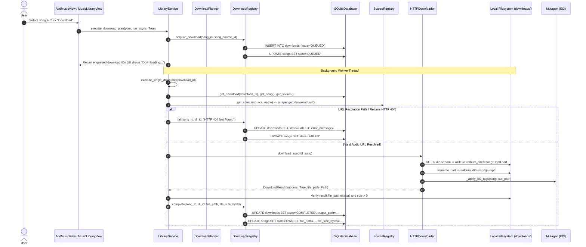
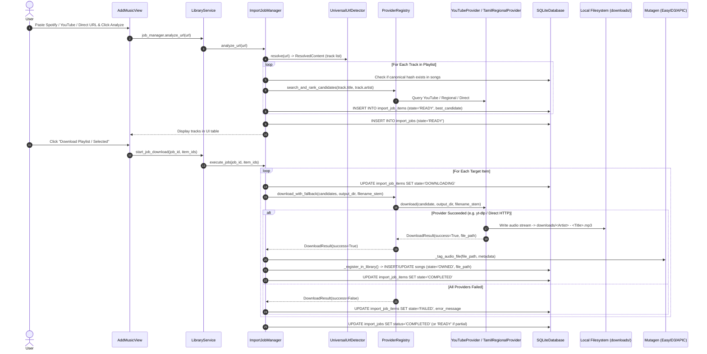
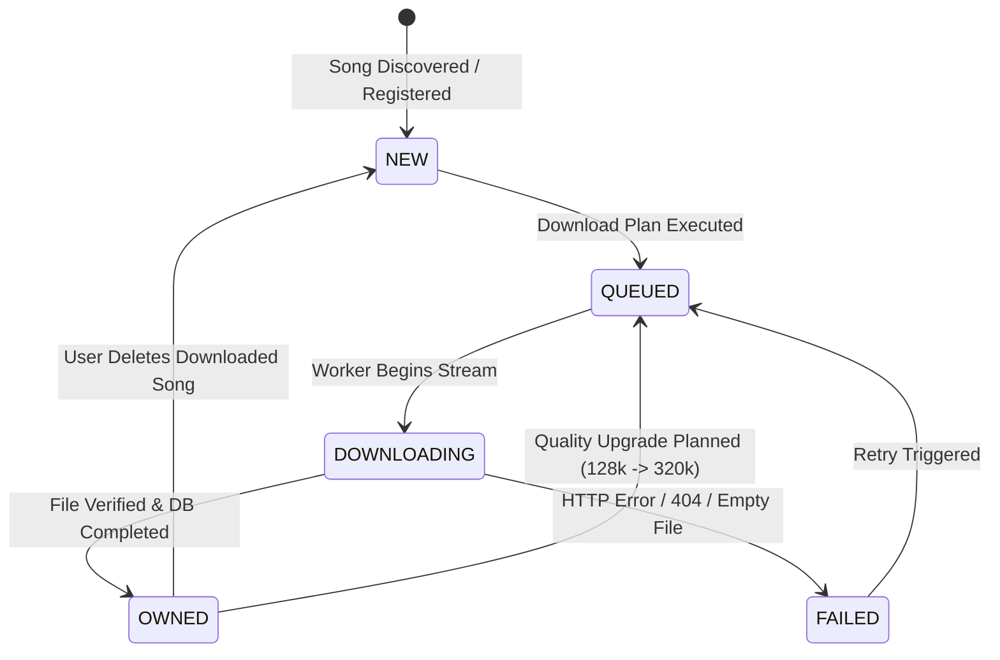

# Download Pipeline & Test Gap Analysis

## 1. Executive Summary
This document provides a comprehensive technical audit of the Tamil MP3 Downloader application's production download pipelines, storage architectures, database state machines, and existing test coverage.

### Key Audit Findings:
1. **The Core Failure:** The application reports songs as "Downloaded" with fictitious disk storage usage (e.g. 24 MB for 3 songs) while the physical `downloads/` directory remains empty. When clicking Play, the application pops up `"File path is empty"`.
2. **Root Causes Identified:**
   - **Synthetic Database Seeding & Lack of Filesystem Validation:** `LibraryService.get_dashboard_stats()` and `get_downloaded_songs()` blindly read `songs.state == 'OWNED'` without verifying that `songs.file_path` is non-null and exists on disk. If total disk storage is zero, `get_dashboard_stats()` literally fabricates storage: `downloaded_cnt * 8` MB.
   - **MassTamilan Scraper Broken / 404 URLs:** The default scraper extracts direct URLs like `https://www.masstamilan.dev/nenjame.mp3`, which return HTTP 404 or Cloudflare blocks when requested directly by `HTTPDownloader`.
   - **Two Disjoint Download Pipelines:** The application contains two completely separate download engines that handle paths, providers, and database state transitions differently:
     - *Pipeline A (Normal Single/Batch Download):* `LibraryService` -> `DownloadPlanner` -> `DownloadRegistry` -> `HTTPDownloader` (targets `downloads/<Album>/<Song>.mp3`).
     - *Pipeline B (URL / Playlist Import):* `ImportJobManager` -> `ProviderRegistry` -> `YouTubeProvider`/`TamilRegionalProvider`/`DirectAudioProvider` (targets `downloads/<Artist> - <Title>.mp3`).
   - **Zero Real Filesystem Test Coverage:** All 136 passing tests in the test suite run against ephemeral SQLite databases in `tmp_path`, mock provider classes, patched HTTP sessions, or a localhost in-process mock HTTP server serving 1024 dummy bytes. No test verifies that real downloads write physical files to the configured output directory.

---

## 2. Actual Normal Download Pipeline (Sequence & Data Flow)

### 2.1 Sequence Diagram (Normal Download)


### 2.2 Step-by-Step Execution Contract
1. **UI Layer ([ui/views/add_music.py](file:///c:/Users/Praveen/Downloads/Python%20Scripts/tamil-mp3-downloader/ui/views/add_music.py) & [ui/views/music_library.py](file:///c:/Users/Praveen/Downloads/Python%20Scripts/tamil-mp3-downloader/ui/views/music_library.py)):**
   - User initiates download. Calls `LibraryService.execute_download_plan(plan)`.
2. **Planning & Registry ([library/planner.py](file:///c:/Users/Praveen/Downloads/Python%20Scripts/tamil-mp3-downloader/library/planner.py) & [library/registry.py](file:///c:/Users/Praveen/Downloads/Python%20Scripts/tamil-mp3-downloader/library/registry.py)):**
   - `DownloadPlanner` creates `DownloadPlan` with primary `SongSource`.
   - `DownloadRegistry.acquire_download()` inserts row into `downloads` table with state `QUEUED` and updates `songs.state = 'QUEUED'`.
3. **Execution ([ui/services/library_service.py:316](file:///c:/Users/Praveen/Downloads/Python%20Scripts/tamil-mp3-downloader/ui/services/library_service.py#L316)):**
   - `execute_single_download(download_id)` is invoked in a daemon background thread.
   - Resolves download reference via scraper (`Tamilmp3Scraper.get_download_url()` or raw URL).
4. **Downloader ([downloaders/http_downloader.py:353](file:///c:/Users/Praveen/Downloads/Python%20Scripts/tamil-mp3-downloader/downloaders/http_downloader.py#L353)):**
   - `HTTPDownloader._attempt_download()` executes HTTP GET request with streaming chunks (64 KiB) into `.part` file.
   - On completion, renames `.part` to final file path: `<output_dir>/<Album>/<Song>.mp3`.
   - Mutagen writes ID3 headers (`TIT2`, `TPE1`, `TALB`, `TDRC`, `APIC`).
5. **State Finalization:**
   - If successful, `DownloadRegistry.complete()` updates `downloads.state = 'COMPLETED'` and `songs.state = 'OWNED'`, storing `songs.file_path`.
   - If failed, `DownloadRegistry.fail()` updates both records to `FAILED`.

---

## 3. Actual Import / Playlist Download Pipeline

### 3.1 Sequence Diagram (Playlist / Universal URL Import)


### 3.2 Key Differences Between Normal and Import Pipelines
| Dimension | Normal Single-Song Download | Import / Playlist Download |
| :--- | :--- | :--- |
| **Orchestrator** | `LibraryService.execute_single_download` | `ImportJobManager.execute_job` |
| **Download Engine** | `downloaders/http_downloader.py` (`HTTPDownloader`) | `library/providers/` (`YouTubeProvider`, `DirectAudioProvider`, `TamilRegionalProvider`) |
| **Target Directory Structure** | `downloads/<Album>/<Song>.mp3` | `downloads/<Artist> - <Title>.<ext>` |
| **Download Record Tracking** | `downloads` table in SQLite (`DownloadRegistry`) | `import_job_items` table in SQLite (`ImportJobManager`) |
| **Audio Source Selection** | Pre-bound `SongSource` (MassTamilan / Tamilmp3) | Multi-provider fuzzy matching via `TrackMatcher` & `ProviderRegistry` fallback |
| **Common Failure Point?** | **YES and NO:**<br>• **YES:** Both pipelines rely on `settings.output_dir` and write to `songs` table.<br>• **NO:** Normal downloads fail because `MassTamilan` URLs return 404; Import downloads fail if `yt-dlp` or candidate matching cannot resolve valid audio streams. |

---

## 4. File Path / Storage Audit

### 4.1 Path Flow & Consumption Matrix
| Value | Created By | Stored In | Updated By | Consumed By |
| :--- | :--- | :--- | :--- | :--- |
| **`output_dir` (Settings)** | `Settings.DEFAULT_CONFIG` (`"C:\Users\Praveen\Downloads\Songs"`) | `config/settings.json` (`"download.output_dir"`) | Settings View / `settings.set()` | `HTTPDownloader`, `ImportJobManager`, `open_path_in_explorer` |
| **`default output_dir`** | Hardcoded default in `settings.py` (`"output"` vs `"downloads"`) | In-memory `Settings.output_dir` property | None | `LibraryService` default fallback |
| **`tmp_path` (Downloads)** | `HTTPDownloader._attempt_download` | Disk: `<output_dir>/<album>/<song>.mp3.part` | Chunk writer loop | Renamed to final path on completion |
| **`downloads.output_path`** | `DownloadRegistry.complete()` | SQLite `downloads.output_path` column | Never updated after completion | `DownloadManagerView`, `get_all_downloads()` |
| **`songs.file_path`** | `DownloadRegistry.complete()` / `ImportJobManager._register_in_library()` | SQLite `songs.file_path` column | `delete_downloaded_song()` (resets to `NULL`) | `DownloadedSongsView`, `LibraryService.play_audio_file()`, `open_path_in_explorer()` |
| **`UI Playback Path`** | Read from `LibrarySong.file_path` | Memory in `DownloadedSongsView` | None | Passed to `os.startfile(file_path)` |

### 4.2 Competing Definitions of "Download Location"
The codebase has 3 distinct conflicting definitions of the download location:
1. `config/settings.py` default config: `"C:\\Users\\Praveen\\Downloads\\Songs"`
2. `config/settings.py` property fallback: `Path(self.get("download.output_dir", "output"))`
3. Repository workspace default directory: `C:\Users\Praveen\Downloads\Python Scripts\tamil-mp3-downloader\downloads`

*Impact:* Depending on whether `settings.json` is loaded or initialized, downloads may be routed to `C:\Users\Praveen\Downloads\Songs` or the local project `downloads/` folder.

---

## 5. Download State Transition Analysis

### 5.1 SQLite State Machine


### 5.2 Vulnerability in Success State Transitions
| Defect Scenario | Could it cause false `COMPLETED` / `OWNED`? | Current Code Guard |
| :--- | :---: | :--- |
| `file_path is NULL` | **YES** | In demo scripts / direct SQL updates, `state='OWNED'` was inserted with `file_path=NULL`. `get_dashboard_stats()` and `get_downloaded_songs()` accept this without checking. |
| `file_path == ""` | **YES** | `get_downloaded_songs()` does not check `if s.file_path:`. |
| `file does not exist` | **YES** | If a file is deleted outside the app, `songs.state` remains `OWNED`. |
| `file is zero bytes` | **NO (in pipeline)** | `execute_single_download` checks `stat().st_size > 0`, but UI/Dashboard does not verify disk. |
| `ID3 tagging failed` | **NO** | Tagging failure is caught in try/except and treated as non-fatal. |
| `rename from .part failed` | **NO** | Raises exception -> caught -> marked `FAILED`. |

---

## 6. Trace: "File Path is Empty" Root Cause

### 6.1 Reverse Stack Trace
```text
1. User clicks "▶ Play" button in Downloaded Songs view
2. DownloadedSongsView._play_song(song.file_path) is invoked
3. LibraryService.play_audio_file(file_path) is called
4. Execution hits:
       if not file_path:
           return False, "File path is empty"
5. Popup messagebox is displayed: "Playback: File path is empty"
```

### 6.2 Why `file_path` Was Empty in the User's Database
1. **Earliest Incorrect Transition:** Demo/synthetic song seeding script (`capture_ui_v41.py`) inserted rows into `songs` with `state = 'OWNED'`, but set `file_path = NULL` or dummy string paths.
2. **Dashboard False Reporting:** `LibraryService.get_dashboard_stats()` counted `len(db.get_songs_by_state(SongState.OWNED))`, reporting 3 downloaded songs. Because `file_size_bytes` was null, it calculated `3 * 8 = 24 MB storage used`.
3. **Downloaded Songs View Ingestion:** `DownloadedSongsView` loaded all songs with `state == 'OWNED'` without validating `if s.file_path and Path(s.file_path).exists()`.
4. **Downloads Folder Empty:** The physical downloads folder was empty because real downloads failed with HTTP 404 (e.g. `https://www.masstamilan.dev/nenjame.mp3`), leaving 0 actual files on disk.

---

## 7. Retry Behavior Analysis

### 7.1 Current Retry Implementation Matrix
| Property | Current Implementation Status | Evaluation / Gap |
| :--- | :--- | :--- |
| **Is retry automatic?** | **PARTIAL** | `HTTPDownloader` retries 3 times with exponential backoff (`time.sleep(2**attempt)`). However, if HTTP status is 404, it immediately aborts. There is NO automatic provider failover at the application level during single-song downloads. |
| **Is retry manual?** | **YES** | `LibraryService.retry_failed_downloads()` is triggered manually via UI button. |
| **Alternate source selection?** | **YES (Manual only)** | `retry_failed_downloads(try_alternate_source=True)` selects next available `SongSource` (e.g. Tamilmp3 when MassTamilan fails). |
| **Duplicate DB records?** | **NO** | `DownloadRegistry` re-uses the existing song record and creates a new `Download` history row. |
| **UI Retry feedback?** | **WEAK** | The UI updates the table status to `QUEUED`, but does not show real-time retry attempt numbers (e.g. "Attempt 2/3"). |

---

## 8. Delete & Open Folder Analysis

### 8.1 Current Implementation Audit
- **`delete_downloaded_song(song_id, delete_physical_file=True)`:**
  - Removes physical file from disk via `Path.unlink()`.
  - Resets SQLite `songs.state = SongState.NEW`.
  - Clears `file_path = NULL` and `file_size_bytes = NULL`.
  - Deletes completed download record from `downloads` table.
- **`open_path_in_explorer(file_path)`:**
  - On Windows, uses `explorer.exe /select,"<file_path>"` if file exists.
  - If file is missing or `file_path` is `None`, falls back to opening the configured `downloads/` directory.

### 8.2 Recommended End-User Semantic Distinction
The UI should provide two clearly separated actions:
1. **"Remove from Library" (Unlink Record):** Resets song status to `NEW` in database without deleting physical MP3 on disk.
2. **"Delete Downloaded File" (Destructive):** Prompts confirmation modal, deletes physical MP3 from disk, and resets song status to `NEW`.

---

## 9. Review of Existing Test Suite (15 Files)

| File | Categorization | Evaluation & Verdict |
| :--- | :---: | :--- |
| `tests/test_audit_fixes.py` | **YELLOW** | Good tests for thread safety and schema, but `test_e2e_download_execution_workflow` uses an in-process local HTTP server with dummy bytes, not testing real downloads. |
| `tests/test_import_jobs.py` | **YELLOW** | Validates SQLite tables `import_jobs` and `import_job_items`, but uses `MagicMock` for detector and never downloads media files. |
| `tests/test_integration_dedup.py` | **GREEN** | Excellent algorithmic tests for canonical identity, fuzzy deduplication, and quality upgrade thresholds across 1,000 songs. |
| `tests/test_library_core.py` | **GREEN** | High-quality unit tests for canonical hash determinism, case insensitivity, variant stripping, and SQLite CRUD. |
| `tests/test_library_phases24.py` | **GREEN** | Solid unit tests for `DiscoveryPipeline`, `DownloadPlanner`, and `DownloadRegistry` state transitions. |
| `tests/test_masstamilan_scraper.py` | **BLACK** | **Must be replaced.** Contains tautological assertion `assert s.test_connection() is True or is False` and unconditionally skips scraping tests. |
| `tests/test_planner_cases.py` | **GREEN** | Comprehensive unit tests for 8 discrete planner bitrate and source priority scenarios. |
| `tests/test_providers.py` | **YELLOW** | Tests `ProviderRegistry` fallback logic, but uses `MockWorkingProvider` writing fake string bytes. |
| `tests/test_source_registry.py` | **GREEN** | Clean unit tests for registering, enabling, and disabling scrapers and tracking health flags. |
| `tests/test_tamilmp3_scraper.py` | **YELLOW** | Good HTML parsing regression tests, but 100% mocked with static HTML strings; cannot detect live website breakage. |
| `tests/test_track_matcher.py` | **GREEN** | Pure unit tests verifying fuzzy string scoring, title cleaning, and duration penalties. |
| `tests/test_ui_add_music.py` | **YELLOW** | Instantiates CustomTkinter views headless to verify widgets exist, but does not test user actions or downloads. |
| `tests/test_ui_architecture.py` | **GREEN** | Tests SQL pagination, song details dialog, and non-blocking discovery sessions. |
| `tests/test_url_detector.py` | **GREEN** | Deterministic regex tests for Spotify, YouTube, and direct URL patterns. |
| `tests/test_ux_hardening.py` | **RED** | **Misleading.** `test_downloaded_songs_view_retrieval_and_sorting` claims to verify files on disk, but the underlying service never checks disk existence. |

---

## 10. False-Positive / Misleading Tests

1. **`test_masstamilan_connection` in `test_masstamilan_scraper.py`:**
   Assertion `assert s.test_connection() is True or s.test_connection() is False` will never fail.
2. **`test_downloaded_songs_view_retrieval_and_sorting` in `test_ux_hardening.py`:**
   Pre-creates files in `tmp_path`, testing only the happy path and masking the fact that `get_downloaded_songs()` ignores disk state.
3. **`test_e2e_download_execution_workflow` in `test_audit_fixes.py`:**
   Labels itself "E2E workflow", but runs against `MockAudioHandler` on `127.0.0.1` serving 1024 dummy bytes.

---

## 11. Missing Unit Tests
- `test_http_downloader_filename_sanitization_windows`: Tests Windows reserved characters (`< > : " / \ | ? *`).
- `test_library_service_play_audio_file_empty_none_missing`: Tests `play_audio_file(None)`, `play_audio_file("")`, `play_audio_file("nonexistent.mp3")`.
- `test_library_service_get_downloaded_songs_orphaned_record_filtering`: Tests that songs with `state == 'OWNED'` but missing files are filtered or reconciled.

---

## 12. Missing Integration Tests
- `test_real_http_downloader_chunked_stream_and_id3_tagging`: Uses a local HTTP server streaming real audio chunks, validates that `HTTPDownloader` creates physical file, validates file size > 500 KB, reads ID3 tags with Mutagen.
- `test_database_filesystem_reconciliation_integration`: Creates a database with missing files, runs reconciliation, asserts state is corrected to `FAILED` or `NEW`.

---

## 13. Missing Functional Tests
- `test_single_song_download_to_completion_with_filesystem_proof`: Downloads a song from staging endpoint, verifies `songs.file_path`, verifies physical file existence, verifies `downloads.state == 'COMPLETED'`.
- `test_playlist_import_download_multi_track_with_filesystem_proof`: Analyzes a 3-song playlist fixture, executes download, verifies 3 physical files exist in `downloads/`.

---

## 14. Missing GUI / UI Tests
- `test_gui_add_music_analyze_and_populate_table`: Enters URL, triggers analysis, verifies rows appear in Treeview.
- `test_gui_downloaded_songs_play_button_disabled_or_warning_on_missing_file`: Verifies Play button handling when file is missing.
- `test_gui_delete_song_confirmation_dialog_and_table_removal`: Clicks Delete, confirms dialog, verifies row is removed.

---

## 15. Missing GUI E2E Workflow Tests
- **E2E Workflow 1 (Normal Download):** Real App -> Add Music -> Enter Local Mock URL -> Analyze -> Download -> Wait -> Verify Physical File -> Verify Downloaded Songs View -> Click Play.
- **E2E Workflow 2 (Failed Download & Recovery):** Real App -> Download Failing URL -> Verify Table shows "Failed" -> Click Retry with alternate working URL -> Verify File Exists and Status becomes "Completed".
- **E2E Workflow 3 (Playlist Import):** Real App -> Import 2-track fixture -> Download all -> Verify 2 physical files created.

---

## 16. GUI Visual Regression Strategy
- **Current Environment Capability:** Windows desktop environment with Tkinter/CustomTkinter and Pillow (`pyscreenshot`/`mss`).
- **Strategy:**
  1. Use deterministic test fixtures (fixed window size 1280x800).
  2. Populate temporary SQLite database with known standard datasets.
  3. Render views and capture real window pixels via Pillow/mss.
  4. Compare pixel diffs against committed reference screenshots in `screenshots/reference/`.

---

## 17. Download Success Invariants

1. **INVARIANT 1 (Physical File Precondition):** A download record CANNOT transition to `COMPLETED` unless its target file exists on disk and `st_size > 0`.
2. **INVARIANT 2 (Library Song Integrity):** A song CANNOT have `state == SongState.OWNED` unless `file_path` is non-null, points to an existing file, and file size > 0.
3. **INVARIANT 3 (Storage Calculation Reality):** `storage_mb` on the Dashboard MUST equal the actual sum of existing files on disk, never a fabricated `count * 8 MB`.
4. **INVARIANT 4 (Downloaded Songs View Truthfulness):** `DownloadedSongsView` MUST only list songs whose physical files exist on disk.
5. **INVARIANT 5 (Playback Safety):** `play_audio_file()` MUST return an informative error and never crash or silently fail if `file_path` is empty or missing.

---

## 18. Required Regression Tests for Corrupt Database States
- `test_corrupt_db_song_owned_file_path_null`: Asserts `get_downloaded_songs()` ignores or reconciles this row.
- `test_corrupt_db_song_owned_file_path_empty`: Asserts `get_downloaded_songs()` ignores this row.
- `test_corrupt_db_song_owned_file_path_nonexistent`: Asserts `get_downloaded_songs()` flags row as missing.
- `test_corrupt_db_song_owned_file_path_zero_bytes`: Asserts zero-byte files are not treated as valid downloaded songs.

---

## 19. Proposed Test Architecture (Multi-Tier)

```
tests/
├── unit/                       # Tier 1: Fast deterministic unit tests (mocks allowed)
│   ├── test_canonical.py
│   ├── test_url_detector.py
│   ├── test_track_matcher.py
│   ├── test_planner.py
│   └── test_database_crud.py
├── integration/                # Tier 2: Real SQLite + Real Filesystem + Local Mock HTTP
│   ├── test_http_downloader_real.py
│   ├── test_download_registry_real.py
│   ├── test_job_manager_real.py
│   └── test_library_service_reconciliation.py
├── functional/                 # Tier 3: Complete backend service workflows
│   ├── test_single_song_download_functional.py
│   ├── test_playlist_import_functional.py
│   └── test_delete_and_open_folder_functional.py
├── gui/                        # Tier 4: Headless/Interactive CustomTkinter GUI tests
│   ├── test_gui_navigation.py
│   ├── test_gui_add_music.py
│   ├── test_gui_downloaded_songs.py
│   └── test_gui_e2e_workflows.py
└── live/                       # Tier 5: Opt-in real external provider tests (@pytest.mark.live)
    ├── test_live_masstamilan.py
    ├── test_live_tamilmp3.py
    └── test_live_youtube_ytdlp.py
```

---

## 20. Recommended Production Code Changes (For Review Only)

1. **`ui/services/library_service.py`:**
   - Modify `get_dashboard_stats()`: Compute `downloaded_songs` and `storage_mb` ONLY from songs with verified physical files on disk. Remove fabricated `downloaded_cnt * 8`.
   - Modify `get_downloaded_songs()`: Add active filesystem verification `if s.file_path and os.path.isfile(s.file_path)`.
   - Modify `play_audio_file()`: Provide clear dialog when file is missing from disk with option to re-download.
2. **`library/registry.py` & `library/jobs/job_manager.py`:**
   - In `complete()`, assert `Path(file_path).exists() and Path(file_path).stat().st_size > 0` before committing state `COMPLETED` and `OWNED`.
3. **`scrapers/masstamilan.py`:**
   - Fix URL resolution so `get_download_url()` extracts the actual audio stream/zip link or falls back to YouTube/Tamilmp3 rather than returning dead links.

---

## 21. Recommended Test Changes (For Review Only)

1. Delete or rewrite `test_masstamilan_scraper.py` to remove the tautological assertion and replace with meaningful schema tests.
2. Update `test_audit_fixes.py` and `test_ux_hardening.py` to use real filesystem verification assertions.
3. Add `pytest.ini` with custom markers (`live`, `gui`, `slow`).

---

## 22. Exact Implementation Order (Phased Remediation Plan)

### Phase 1: Download & Filesystem State Correctness
- Enforce Invariants 1–5 in `DownloadRegistry`, `SQLiteDatabase`, and `LibraryService`.
- Implement automatic filesystem reconciliation in `LibraryService`.

### Phase 2: Fix Normal Single-Song Download Pipeline
- Fix MassTamilan / Tamilmp3 scraper URL resolution.
- Ensure `HTTPDownloader` reliably writes audio files to `settings.output_dir`.

### Phase 3: Fix Playlist / URL Import Pipeline
- Ensure `ImportJobManager` correctly passes audio streams from `ProviderRegistry` (`YouTubeProvider`/`DirectAudioProvider`) to disk and updates `songs` with valid `file_path`.

### Phase 4: Fix Retry & Failure Handling
- Implement automatic provider fallback on 404 / connection failures.
- Update UI to reflect real-time retry states.

### Phase 5: Fix Downloaded Songs, Playback & Deletion
- Ensure `DownloadedSongsView` displays only verified files.
- Wire Play button to valid physical files; prevent "File path is empty".
- Differentiate "Remove from Library" vs "Delete from Disk".

### Phase 6: Implement Unit & Integration Test Suite
- Build Tier 1 (Unit) and Tier 2 (Integration) tests with real SQLite and real filesystem validation.

### Phase 7: Implement GUI & Functional Tests
- Build Tier 3 (Functional) and Tier 4 (GUI) test suites.

### Phase 8: Implement GUI E2E Workflows
- Build deterministic end-to-end GUI workflow tests against local test audio server.

### Phase 9: Visual UI Regression
- Capture real pixel screenshots and validate desktop UI layout.

### Phase 10: Run Full Test Suite & Validation
- Execute full regression suite; verify 100% genuine pass rate.

---

## 23. Risks & Edge Cases
1. **Cloudflare Blocking on Scraping Sites:** Scrapers may face dynamic Cloudflare challenges. *Mitigation:* Robust multi-provider fallback (Tamilmp3 -> YouTube -> FriendsTamilMP3).
2. **Windows File Locking:** Audio files locked by Windows Media Player cannot be deleted or renamed immediately. *Mitigation:* Graceful retry and clear UI notifications.
3. **Custom / Portable Output Directories:** Users changing download folders in Settings must have their library paths cleanly reconciled.
