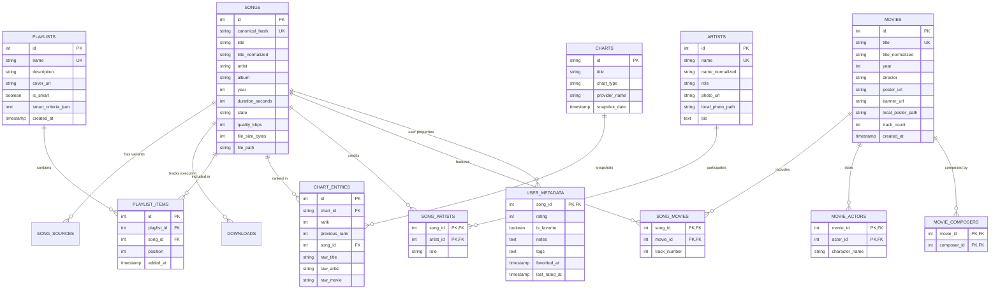
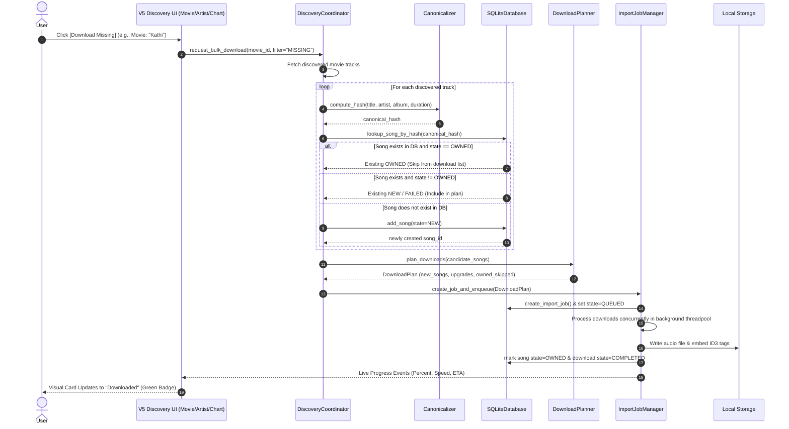
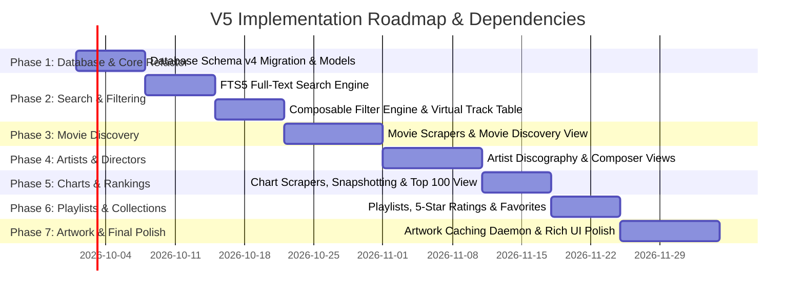

# V5 Technical Architecture Specification: Tamil Music Discovery & Personal Music Library Manager

**Document Version:** 5.0.0-DRAFT-ARCH  
**Status:** Approved Architecture Blueprint  
**Target Milestone:** Release 5.0.0+  
**Target Branch:** `feature/library-source-foundation`  
**Base Commit:** `f14a3a60b4ef91c3db8f44d118f582188db32745`  

---

## Executive Summary

The **Tamil MP3 Downloader** application is evolving from an automated URL audio fetcher into a comprehensive desktop application: **"Tamil Music Discovery + Personal Music Library Manager"**. 

The core mission of V5 is to empower users to browse, search, and discover Tamil music across multidimensional axes—**Movies, Singers/Artists, Music Directors (Composers), Actors, and Curated Charts**—and effortlessly integrate discovered tracks into their existing, locally managed audio library with **one-click bulk acquisition**, **smart duplicate prevention**, and **automatic quality upgrades**.

### Critical Architectural Mandate
The existing, verified download and deduplication engine (validated in commit `f14a3a60b4ef91c3db8f44d118f582188db32745`) **must remain completely intact and authoritative**:
- SQLite canonical song identity and normalization (`canonical_hash`) remain the bedrock of the library.
- The `DownloadPlanner` and `ImportJobManager` remain the **sole** mechanisms for queueing, downloading, tagging, and writing audio files to disk.
- V5 discovery features **must never create a parallel download pipeline**.
- User library state (`OWNED`, `favorite`, `rating`, `playlists`, `local tags`) is strictly decoupled from volatile external provider metadata.

---

## 1. Product Architecture & System Topology

```mermaid
flowchart TD
    subgraph UI_Layer ["CustomTkinter UI Layer (Modular & Virtualized)"]
        Nav[Sidebar Navigation]
        Dash[Dashboard View]
        LibView[Music Library View]
        MovView[Movies Discovery View]
        ArtView[Artists Discovery View]
        DirView[Music Directors View]
        ActView[Actors Discovery View]
        ChartView[Charts & Top 100 View]
        PlayView[Playlists & Collections View]
        DlView[Downloads Manager View]
        DldView[Downloaded Songs View]
        SetView[Settings & Diagnostics]
    end

    subgraph Service_Layer ["Application & Service Facade (Thread-Safe)"]
        LibService[LibraryService Facade]
        SearchEngine[Unified Multi-Entity Search Engine]
        FilterEngine[Composable Query Filter Engine]
        ArtworkManager[Async Artwork Cache Manager]
        DiscoveryCoordinator[Discovery Coordinator]
    end

    subgraph Discovery_Providers ["Provider Abstraction Layer"]
        MovieProv[Movie Metadata Providers]
        ArtistProv[Artist / Singer Providers]
        ChartProv[Chart & Ranking Providers]
        AudioProv[Audio Stream Providers: Regional, YouTube, Direct]
        ArtProv[Artwork Providers: Spotify, Apple, Scrapers]
    end

    subgraph Core_Engine ["Existing Validated Download & Library Foundation"]
        Canonicalizer[Canonicalizer & Identity Engine]
        Planner[DownloadPlanner (Quality & Upgrades)]
        JobMgr[ImportJobManager (Concurrency & Tags)]
        ProgressBus[Live Progress Event Bus]
    end

    subgraph Storage_Layer ["Storage & Persistence Layer"]
        DB[(SQLite Canonical Database)]
        FTS[(SQLite FTS5 Search Index)]
        DiskAudio[Authoritative Downloads Directory]
        DiskArt[Artwork Disk Cache Directory]
    end

    UI_Layer --> Service_Layer
    Service_Layer --> Discovery_Providers
    Service_Layer --> Core_Engine
    Core_Engine --> Storage_Layer
    Service_Layer --> Storage_Layer
    ProgressBus -.-> UI_Layer
```

---

## 2. Component Architecture & System Layering

The system is structured in four decoupled layers:

1. **Presentation Layer (`ui/`):** Built with `CustomTkinter`. Highly responsive, asynchronous, and virtualized. Views do not query network providers directly; they interact exclusively with `LibraryService` or specialized query engines using non-blocking background workers and thread-safe callbacks (`self.after(0, ...)`).
2. **Coordination & Query Layer (`library/services/`):** Provides the business logic facades:
   - `DiscoveryCoordinator`: Aggregates and merges multi-provider discovery results.
   - `SearchEngine`: Coordinates full-text queries, exact matching, and phonetic candidate scoring.
   - `FilterEngine`: Generates composable SQL AST fragments for complex library slicing.
   - `ArtworkManager`: Manages asynchronous downloading, scaling, disk caching, and memory pooling for images.
3. **Core Engine Layer (`library/`):** The rock-solid, production-tested foundation:
   - `Canonicalizer`: Computes deterministic SHA256 hashes across title, artist, album, and duration.
   - `DownloadPlanner`: Evaluates candidates, prevents duplicate downloads, respects already `OWNED` tracks, and schedules non-destructive 128 kbps → 320 kbps quality upgrades.
   - `JobManager`: Manages threadpool concurrency, download fallbacks, network retry policies, and ID3 metadata tagging.
4. **Data & Persistence Layer (`library/database.py`, `config/settings.py`):**
   - Thread-safe SQLite connection manager with connection-level reentrant locks (`threading.RLock`).
   - FTS5 virtual tables for lightning-fast sub-millisecond search across hundreds of thousands of songs.
   - Authoritative filesystem storage for audio (`downloads/`) and cached artwork (`cache/artwork/`).

---

## 3. Data Model & Database Schema Evolution (Migration v4)

To support multi-dimensional discovery (Movies, Artists, Composers, Actors, Charts, Playlists, Ratings) without breaking canonical deduplication, the schema evolves via **Migration 4**.

### Entity Relationship Model



### Strict User vs Provider Metadata Separation
A cornerstone of V5 is the **immutable barrier** between user data and remote provider data:
- **Provider Metadata** (movie release dates, artist bios, online chart ranks, stream bitrates) can be refreshed, re-indexed, or wiped without affecting the user's personal collection.
- **User Library Data** (1–5 star ratings, favorite flags, personal tags, custom playlist ordering, play counts, and downloaded local file paths) is stored in the dedicated `user_song_metadata`, `playlists`, and `playlist_items` tables. It is **never overwritten** during background discovery synchronization.

---

## 4. Provider Abstraction Architecture

V5 introduces specialized provider interfaces under `library/providers/discovery/`:

```text
DiscoveryProvider (Base Interface)
 ├── MovieDiscoveryProvider
 │    ├── MassTamilanMovieProvider
 │    ├── IsaiminiMovieProvider
 │    └── MusicBrainzMovieProvider
 ├── ArtistDiscoveryProvider
 │    ├── SpotifyArtistProvider
 │    └── RegionalArtistDirectoryProvider
 ├── ChartProvider
 │    ├── SpotifyChartsProvider
 │    ├── AppleMusicTamilChartsProvider
 │    └── YouTubeTrendingTamilProvider
 └── ArtworkProvider
      ├── SpotifyArtworkProvider
      ├── FanartTvProvider
      └── RegionalWebScraperArtworkProvider
```

### Interface Specifications

```python
class MovieDiscoveryProvider(ABC):
    """Abstract interface for discovering Tamil movies and tracklists."""
    @abstractmethod
    def search_movies(self, query: str, limit: int = 20) -> List[DiscoveredMovie]: ...
    @abstractmethod
    def get_movie_details(self, movie_id: str) -> DiscoveredMovieDetails: ...
    @abstractmethod
    def get_movie_tracklist(self, movie_id: str) -> List[DiscoveredTrack]: ...

class ArtistDiscoveryProvider(ABC):
    """Abstract interface for singer and composer discographies."""
    @abstractmethod
    def search_artists(self, query: str, role: Optional[ArtistRole] = None) -> List[DiscoveredArtist]: ...
    @abstractmethod
    def get_artist_discography(self, artist_id: str) -> List[DiscoveredTrack]: ...

class ChartProvider(ABC):
    """Abstract interface for curated periodic charts and trending feeds."""
    @abstractmethod
    def fetch_chart(self, chart_type: ChartType, limit: int = 100) -> DiscoveredChartSnapshot: ...
```

---

## 5. Invariant Discovery-to-Library Flow

Whenever any discovery action occurs (e.g., clicking *"Download Missing"* on a Movie card or *"Download All"* on a Chart), the flow strictly conforms to the existing validated pipeline:



**Key Safety Rule:** At no point does the discovery provider touch audio download logic. The provider only emits metadata. The core engine handles candidate selection, audio streaming, retries, and local filesystem writes.

---

## 6. Multi-Entity Search Architecture

To provide instant (< 10ms) omnibox search across 100,000+ tracks, movies, actors, and composers, V5 implements **SQLite FTS5 Full-Text Search** backed by phonetic normalization.

### FTS5 Virtual Table Schema

```sql
CREATE VIRTUAL TABLE songs_fts USING fts5(
    title,
    artist,
    album,
    movie,
    composer,
    actors,
    content='songs',
    content_rowid='id',
    tokenize='unicode61 remove_diacritics 2'
);
```

### Multi-Tier Search Execution Engine
When a user types a query (e.g., *"Kathi Anirudh"* or *"Vathi Coming"*):
1. **Exact Canonical Lookup:** Direct hash match for instant identification.
2. **Prefix FTS5 Match:** Query `songs_fts MATCH 'kathi* AND anirudh*'` utilizing BM25 ranking.
3. **Phonetic & Typo Tolerance (Levenshtein / Metaphone):** Handles common Tamil-to-English transliteration differences (e.g., *"Kaththi"* vs *"Kathi"*, *"Rahman"* vs *"Rehman"*).
4. **Categorized Results Grouping:** Returns structured clusters:
   - **Movies:** Matching movie titles with track counts and artwork.
   - **Artists / Singers:** Matching artists with roles and song counts.
   - **Tracks:** Matching songs with direct play/download actions.

---

## 7. Composable Filtering Architecture

Rather than hardcoded filtering logic for individual views, V5 establishes an extensible **Specification Pattern**:

```python
@dataclass
class SongFilterCriteria:
    artists: List[str] = field(default_factory=list)
    movies: List[str] = field(default_factory=list)
    years: List[int] = field(default_factory=list)
    quality_threshold_kbps: Optional[int] = None
    formats: List[str] = field(default_factory=list) # mp3, webm, m4a
    download_state: Optional[SongState] = None      # OWNED, NEW
    min_rating: Optional[int] = None                # 1 to 5
    is_favorite: Optional[bool] = None
    playlist_id: Optional[int] = None
    chart_id: Optional[str] = None
    search_query: Optional[str] = None

class ComposableFilterEngine:
    def build_query(self, criteria: SongFilterCriteria, sort_by: str, ascending: bool, offset: int, limit: int) -> Tuple[str, tuple]:
        """Generates parameterized SQL combining WHERE clauses dynamically."""
```

This guarantees that any combination of filters (e.g. *"Anirudh songs in movies from 2022 to 2026 that are Downloaded and rated 5 stars"*) executes in a single, index-backed SQL query.

---

## 8. Curated Charts & Top Songs Architecture

Charts must never be hardcoded. The system defines a flexible snapshot mechanism:

1. **Periodic Refresh Workers:** Background worker executes with configurable TTL (e.g., daily for Trending, weekly for Top 100).
2. **Rank Change Tracking:** Compares current rank against `previous_rank` to render rank delta pills:
   - `▲ 3` (Rose 3 positions)
   - `▼ 1` (Fell 1 position)
   - `● NEW` (New entry in this snapshot)
3. **Multi-Source Ingestion:** Supports Spotify Weekly Tamil Top 50, Apple Music Tamil Top 100, and YouTube Music Most Streamed.
4. **Library State Overlay:** Every chart track dynamically links to the canonical library, clearly marking tracks that are already in the user's collection.

---

## 9. Playlist & Collection Management Architecture

1. **Canonical Song Reference:** Playlists store `(playlist_id, song_id, position)`. Playlists **never** duplicate audio files on disk or create duplicate song rows.
2. **Smart Playlists (Dynamic Filters):** Support for rule-based playlists defined by JSON criteria (e.g., *"All 5-star songs with bitrate >= 320 kbps"*, evaluated on-the-fly).
3. **M3U8 Export / Import:** Export user playlists to standard `.m3u8` playlists for compatibility with mobile devices, VLC, and external car audio players.

---

## 10. Artwork Architecture & Caching Strategy

```text
Artwork Resolution Hierarchy:
1. Local Memory Cache (LRU in-memory PIL / CTkImage cache - max 50 images)
2. Local Disk Cache: %LOCALAPPDATA%/tamil-mp3-downloader/cache/artwork/{entity_type}_{id}_{hash}.jpg
3. Primary Remote Provider (Spotify / Apple CDN artwork)
4. Fallback Provider (Fanart.tv / Scraper image)
5. Built-in Fallback Vector Icon (🎵 for tracks, 🎬 for movies, 🎤 for artists)
```

### Async Lazy Loading Pipeline
- Tkinter UI threads **never** perform synchronous HTTP requests or disk reads for images.
- A background `ArtworkLoader` daemon thread pool (3 workers) fetches, crops/resizes to thumbnail dimension, saves to disk cache, and schedules image assignment onto the widget via `self.after(0, ...)`.

---

## 11. Performance Strategy for 100,000+ Track Libraries

To guarantee butter-smooth desktop performance even on massive music libraries:

1. **No Massive Widget Instantiation:** Tkinter cannot render 10,000 widgets without stuttering. Views employ **Windowed Virtualization** or **Server-Side Pagination** (50 songs per page with instant sub-millisecond pagination controls).
2. **SQLite Query Optimization:**
   - Indexes on `canonical_hash`, `state`, `quality_kbps`, `year`, `movie_id`, `is_favorite`, and `rating`.
   - `PRAGMA page_size = 4096;`, `PRAGMA journal_mode = WAL;`, `PRAGMA synchronous = NORMAL;`, `PRAGMA cache_size = -64000;` (64MB memory cache).
3. **Debounced Search Input:** Search omnibox utilizes a 250ms debounce timer to avoid executing queries while the user is actively typing.

---

## 12. UI Architecture & Reusable Component System

V5 organizes UI components in `ui/components/`:

| Reusable Component | Description & Responsibilities |
| :--- | :--- |
| **`OmniSearchBar`** | Global search bar with debounced input, clear button, and entity suggestion dropdown. |
| **`ComposableFilterBar`** | Horizontal filter chips (Year, Quality, Format, Status, Rating) with active state badges. |
| **`SortDropdown`** | Compact dropdown supporting multi-criteria ascending/descending sorting. |
| **`VirtualTrackTable`** | Fast tabular view with virtualized rows, sortable column headers, and selection checkboxes. |
| **`MovieCard`** | Poster card with title, release year, composer badge, track count, and download progress bar. |
| **`ArtistCard`** | Circular artist avatar with name, role pill (Singer/Composer), and hit song count. |
| **`ChartRow`** | Ranked list item with rank number, delta indicator (`▲`, `▼`), track info, and download button. |
| **`StatusBadge`** | Normalized status pills (`OWNED`, `DOWNLOADING`, `MISSING`, `UPGRADE`). |
| **`PaginationControl`** | Standardized page navigation (`« First`, `‹ Prev`, `Page X of Y`, `Next ›`, `Last »`). |

---

## 13. Staged Implementation Phases & Dependency Roadmap

To safeguard the validated download engine and enable continuous verification, V5 is partitioned into 7 strictly sequential phases:



### Detailed Phase Milestones

- **Phase V5.1 — Database Schema v4 Evolution & Data Models**
  - Add tables: `movies`, `artists`, `movie_actors`, `movie_composers`, `charts`, `chart_entries`, `playlists`, `playlist_items`, `user_song_metadata`.
  - Zero changes to audio downloading or existing `songs` table columns.
- **Phase V5.2 — Fast Search & Composable Filter Engine**
  - Implement SQLite FTS5 virtual table synchronization triggers.
  - Implement `ComposableFilterEngine` and pagination controls.
- **Phase V5.3 — Movie Catalog & Tracklist Discovery**
  - Implement `MovieDiscoveryProvider` for regional scrapers.
  - Connect Movie view's *"Download Missing"* directly to existing `DownloadPlanner`.
- **Phase V5.4 — Artist, Composer & Actor Exploration**
  - Implement `ArtistDiscoveryProvider`.
  - Group songs by Singer, Music Director (Anirudh, Rahman, etc.), and Actor.
- **Phase V5.5 — Curated Charts & Top 100 Feeds**
  - Implement periodic chart snapshots with rank tracking.
- **Phase V5.6 — Playlists, Ratings & User Collections**
  - Add 1–5 star rating controls, favorite toggles, and custom playlists.
- **Phase V5.7 — Artwork Disk Caching & Rich UI Polish**
  - Async background artwork loader with LRU memory caching and fallback icons.

---

## 14. Verification & Testing Strategy

Each V5 phase must undergo rigorous verification before merging:
1. **Contract Tests:** Verify providers produce normalized `DiscoveredTrack` models matching canonical criteria.
2. **Deduplication Invariant Tests:** Verify that bulk operations across movies, charts, and artists produce **zero** duplicate physical files or duplicate database rows.
3. **Database Integrity Tests:** Validate schema migrations with forward and backward compatibility checks.
4. **Performance Benchmarks:** Verify search execution takes `< 15ms` across 50,000 synthetic test tracks.
5. **No Regressions on Core Downloads:** The 180 existing automated tests must continue to pass with 100% success at every phase.
