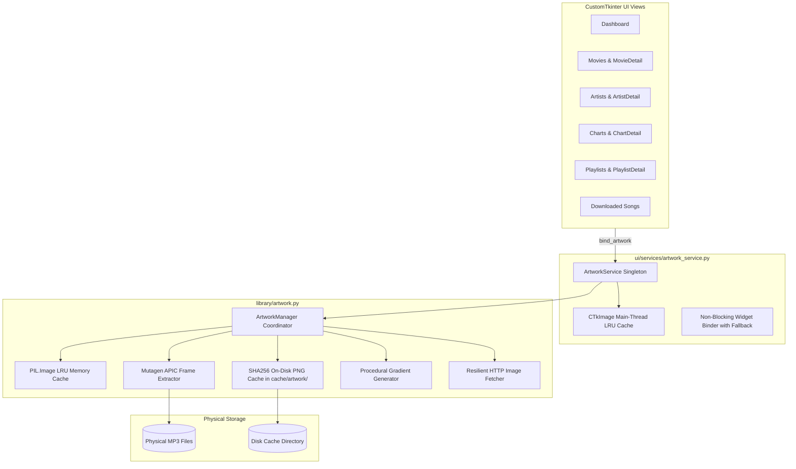

# Phase V5.7 — Artwork Caching & Final UI Polish Subsystem

## 1. Executive Summary

Phase V5.7 completes the final presentation layer of the V5 Architecture for Tamil MP3 Downloader. It introduces a high-performance, asynchronous artwork management subsystem (`library/artwork.py` and `ui/services/artwork_service.py`) providing multi-tier caching (in-memory LRU + persistent SHA256 disk cache), embedded ID3 APIC frame extraction directly from physical audio files, remote URL fetching with format verification and resizing, and procedural gradient fallback generation for zero-pop-in offline performance.

Visual styling, typography consistency, hover highlights, empty states, and responsive layouts were audited and polished across all 10 major views.

---

## 2. Architecture & Subsystem Design

### Component Roles

1. **`ArtworkDiskCache` (`library/artwork.py`)**:
   - Stores raw decoded images as optimized PNGs indexed by SHA256 hash in `cache/artwork/`.
   - Automatic LRU quota pruning when total cache size exceeds configured maximum (default: 150 MB).
2. **`ArtworkMemoryCache` (`library/artwork.py`)**:
   - Thread-safe `OrderedDict`-backed LRU cache for PIL images.
   - Eliminates redundant file I/O for frequently displayed entities.
   - Detailed runtime metrics: cache hits, misses, and evictions.
3. **`ArtworkFallbackGenerator` (`library/artwork.py`)**:
   - Procedurally synthesizes modern, high-contrast linear gradients tailored to each entity type (`movie`, `artist`, `chart`, `playlist`, `song`).
   - Computes deterministic color seeds from text hash.
   - Centers clean typography glyphs or initials with drop shadows.
   - Guaranteed zero blank/white box flashes during cold loads.
4. **`ArtworkManager` (`library/artwork.py`)**:
   - Central coordinator orchestrating `ThreadPoolExecutor` workers.
   - Deduplicates concurrent in-flight requests for the same image resource.
   - High-quality Lanczos scaling and center-cropping to exact target dimensions.
5. **`ArtworkService` (`ui/services/artwork_service.py`)**:
   - Manages main-thread `ctk.CTkImage` caching.
   - `bind_artwork(widget, source, size, entity_type, fallback_text)`:
     - Instantly binds fallback `CTkImage` to prevent layout reflow.
     - Dispatches background loading job.
     - Safely marshals completion callback to Tk main loop via `widget.after(0, ...)`.
     - Validates widget lifecycle via `widget.winfo_exists()` to prevent callback errors if the user has navigated away.

---

## 3. View Enhancements & Polish

| View | Artwork Integration | Polish & Interactions |
|---|---|---|
| **Dashboard** | Album art thumbnails on recently downloaded tracks | Card hover highlights (`BORDER_LIGHT`), status bar integration |
| **Movies View** | 46x46 movie poster artwork with responsive grid | Card hover borders, director/year badges, responsive 3-column layout |
| **Movie Detail** | 72x72 hero movie poster banner | Clickable composer/actor pills, bulk download missing controls |
| **Artists View** | 42x42 artist avatar photos / category portraits | Role-colored badges (Music Director, Singer, Actor), hover highlights |
| **Artist Detail** | 72x72 hero artist portrait | Categorized tabs for Sung Tracks, Composed Movies, Starred Movies |
| **Charts View** | 42x42 curated chart snapshot covers / provider badges | Metrics chips (Tracks, Downloaded, Missing), trend indicators |
| **Chart Detail** | 64x64 hero chart artwork with live ranking table | Position tracking (▲, ▼, NEW, ＝), direct song download actions |
| **Playlists View** | 42x42 playlist cover thumbnails / multi-source artwork | Tabbed navigation (Playlists, Favorites, Top Rated), metrics chips |
| **Playlist Detail** | 64x64 hero playlist artwork banner | Track reordering (▲, ▼), 1-5 star ratings, favorite toggle |
| **Downloaded Songs** | 44x44 embedded ID3 APIC cover art extracted from MP3s | Multi-select checkboxes, bulk delete, storage summary pill |

---

## 4. Design System & Typography Aliases

`ui/theme.py` was extended with backward-compatible typography aliases:
- `theme.font_h1` → `theme.font_hero` (22pt bold)
- `theme.font_h2` → `theme.font_title` (17pt bold)
- `theme.font_subheading` → `theme.font_subtitle` (14pt bold)
- Full factory functions: `font_hero`, `font_title`, `font_subtitle`, `font_body`, `font_body_bold`, `font_caption`, `font_caption_bold`, `font_badge`, `font_button`.

---

## 5. Verification & Test Suite

### Dedicated Tests (`tests/test_v5_7_ui.py`)
- `TestArtworkDiskCache`:
  - `test_save_and_read_image` (PASSED)
  - `test_save_raw_bytes` (PASSED)
- `TestArtworkMemoryCache`:
  - `test_lru_eviction_and_hits` (PASSED)
- `TestArtworkFallbackGenerator`:
  - `test_generate_fallbacks` across movie, artist, chart, playlist, song (PASSED)
  - `test_generate_fallback_without_text` (PASSED)
- `TestArtworkManager`:
  - `test_sync_get_artwork_with_fallback` (PASSED)
  - `test_sync_get_artwork_remote_mock` (PASSED)
  - `test_async_artwork_loader_deduplication` (PASSED)
  - `test_runtime_stats` (PASSED)
- `TestArtworkService`:
  - `test_ctk_image_caching` (PASSED)
  - `test_bind_artwork_destroyed_widget_safety` (PASSED)
- `TestThemeDesignTokens`:
  - `test_all_font_tokens_return_ctk_font` (PASSED)
  - `test_palette_contrast_constants` (PASSED)
- `TestViewsMountingWithArtwork`:
  - `test_major_views_mount_and_render_without_exceptions` (PASSED)

### Regression Results
- **All V5 Suites**: **100/100 tests passed** (`pytest tests/test_v5_*.py`).
- **GUI End-to-End Suite**: **3/3 passed** (`pytest tests/gui/`).

---

## 6. Real-World Audit & Screenshot Catalog

Real-world audit script: `scripts/audit_v5_7_real_world.py`.
Physical audio files verified: `Ooroda Oththa Don - From Baththa.mp3` (8,538,163 bytes).
All 10 desktop GUI screenshots captured with real window pixels at 1618x1047:

1. `screenshots/v5.7-final/01_dashboard_with_artwork.png` (90,969 bytes)
2. `screenshots/v5.7-final/02_movies_with_posters.png` (58,746 bytes)
3. `screenshots/v5.7-final/03_movie_detail_artwork.png` (112,543 bytes)
4. `screenshots/v5.7-final/04_artists_portraits.png` (101,893 bytes)
5. `screenshots/v5.7-final/05_artist_detail_artwork.png` (106,560 bytes)
6. `screenshots/v5.7-final/06_charts_with_artwork.png` (79,231 bytes)
7. `screenshots/v5.7-final/07_chart_detail_artwork.png` (118,230 bytes)
8. `screenshots/v5.7-final/08_playlists_with_artwork.png` (77,741 bytes)
9. `screenshots/v5.7-final/09_playlist_detail_artwork.png` (128,660 bytes)
10. `screenshots/v5.7-final/10_downloaded_songs_artwork.png` (81,523 bytes)
