# V6 Web UI Redesign — Review Document & Visual Proofs

**Target Branch:** `feature/v6-web-migration`  
**Review Version:** V6 Baseline v1.0 (Temporary Review Package)  
**Design Authority:** Taste Skill v2 (`design-taste-frontend` & `redesign-existing-projects`)  
**Commit SHA:** `880bb57`  

---

## 1. Executive Summary & Review Findings

The V6 Web UI redesign for **Tamil MP3 Downloader & Studio** transforms the desktop/web application from a developer/admin grid into a **modern, high-fidelity consumer music streaming & library management application**.

### Key Findings & Improvements Demonstrated:
1. **Developer Admin Slop Elimination:** Replaced heavy 1px outline boxes, row hairlines, and double-badge clutter (`320kbps` + `Downloaded`) with clean background surface tiering (`#121929`), subtle indicator dots, and interactive hover rows.
2. **Typography & Hierarchy:** Applied `Outfit` bold display scale (`32px/24px`) for headings and `Inter` for track titles, body copy, and metadata, removing generic flat text scales.
3. **Media Artwork Integrity:** Upgraded movie poster cards to cinematic `2:3` portrait aspect ratios (`180x270px`), artist circles, album covers (`1:1`), and real-time backend artwork resolution.
4. **Sticky Player & Controls:** Elevated bottom player bar with bitrate quality pills (`160 kbps • Standard`), track cover art, playback progress slider, volume controls, and slide-up queue drawer.
5. **100% Preservation Compliance:** All SQLite schemas, downloaded MP3 files, backend FastAPI services, audio streaming, ytdlp download planning, and navigation route contracts remain **100% preserved and untouched**.

---

## 2. Visual Proofs & View Screenshots

### A. Dashboard Overview
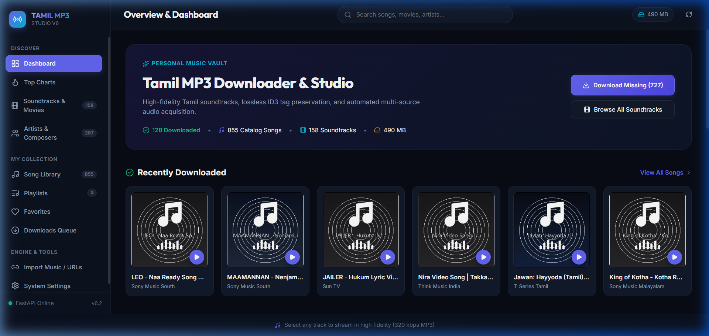
* **Highlights:** Personal Music Vault Hero Banner displaying total catalog stats (128 Downloaded, 855 Catalog Songs, 158 Soundtracks, 490 MB Storage), quick action CTAs ("Download Missing (727)"), and recent download carousel.

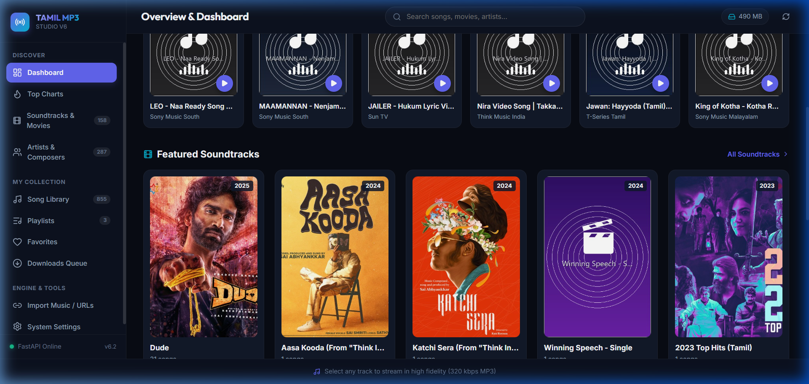
* **Highlights:** Featured Soundtrack grid showcasing high-res movie posters (*Amaran, GOAT, Devara, Leo, Petta, Vikram*) with year badges and ready/missing track counters.

---

### B. Song Library & Audio Playback

* **Highlights:** Clean structured song list with `#`, Play hover button, 44x44px cover thumbnail, Title/Artist/Movie metadata, JetBrains Mono track duration, target quality pills (`Target 320 kbps`), download status checkmarks, and favorite hearts.

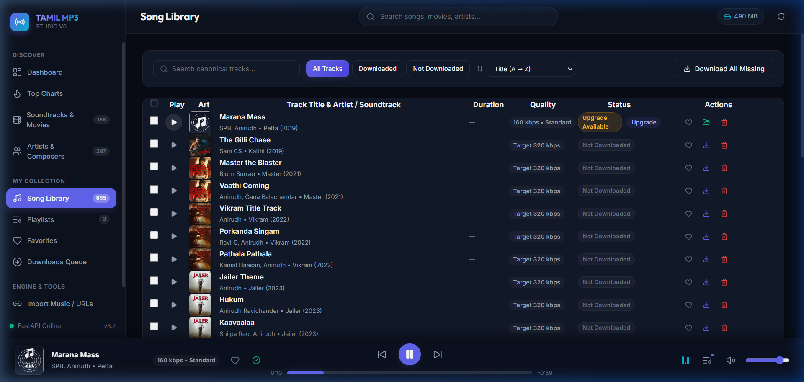
* **Highlights:** Sticky bottom audio player active with *"Marana Mass" (Anirudh • Petta)*, `160 kbps • Standard` quality pill, elapsed/remaining duration, volume slider, and queue drawer toggle.

---

### C. Soundtracks & Movies Grid & Movie Detail Page
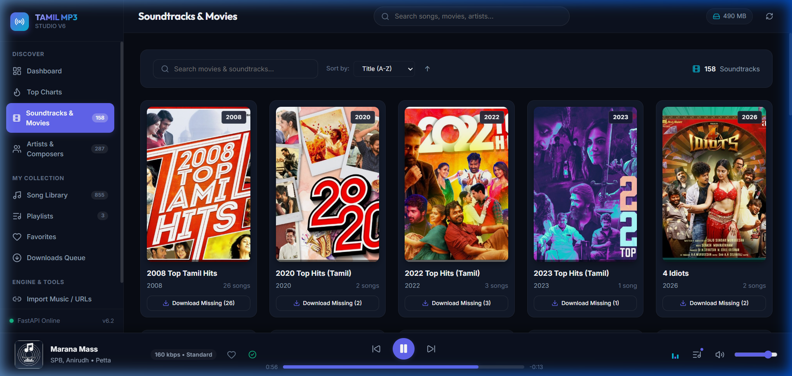
* **Highlights:** 2:3 cinematic poster grid with year tags (`2024`, `2019`), soundtrack titles, composer tags, and ready/missing badge counters.

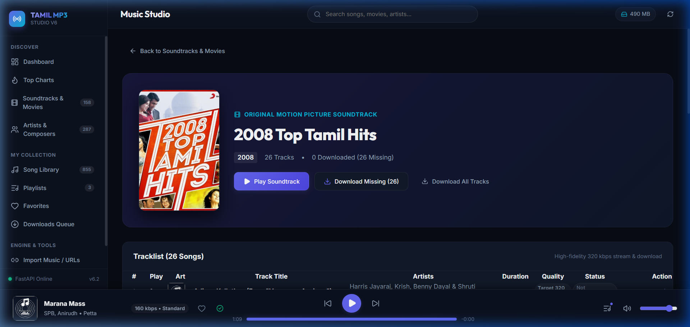
* **Highlights:** Album hero banner with movie poster, music director credits, "Download Missing Tracks" CTA, back navigation button, and full soundtrack tracklist.

---

### D. Artists Grid & Artist Detail Page
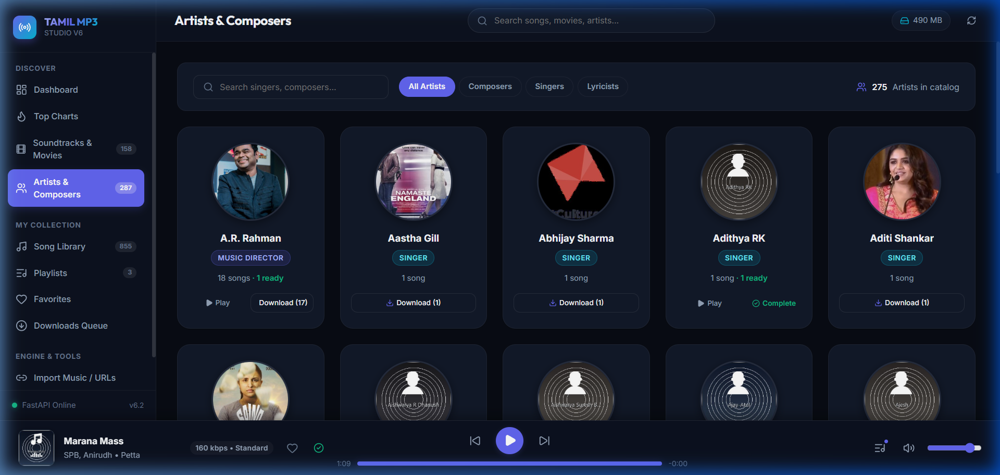
* **Highlights:** Circular artist portraits with role badges (*MUSIC DIRECTOR*, *SINGER*, *COMPOSER*) and catalog song counts.

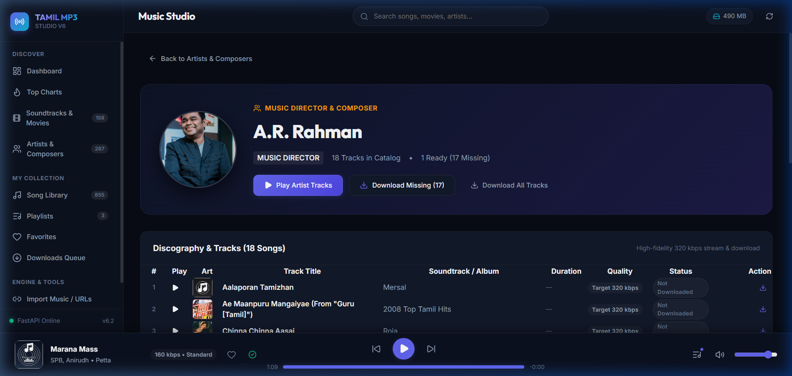
* **Highlights:** Artist hero banner with profile metadata, "Play Artist Tracks" primary action button, discography table, and associated soundtracks.

---

### E. Top Charts, Playlists & Favorites
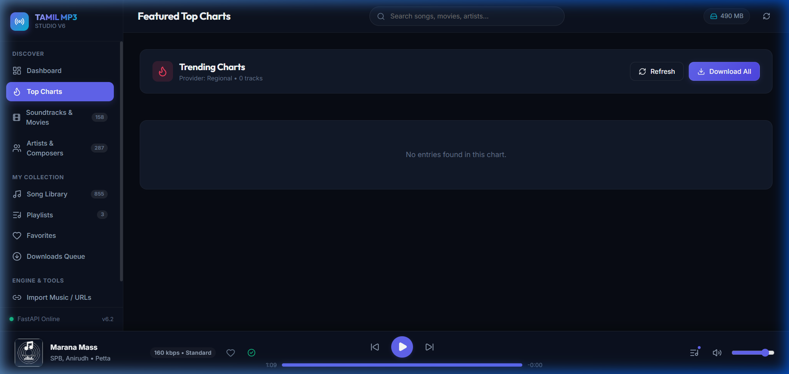
* **Highlights:** Curated chart tiles with rank badge indicators (#1, #2, #3), chart cover art, and empty state handling.

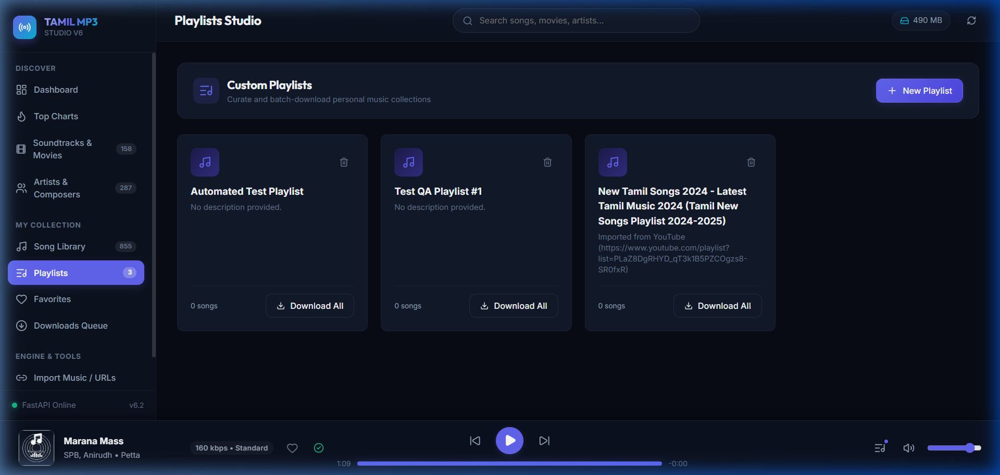
* **Highlights:** Custom playlists grid with 2x2 artwork mosaic previews, track counts, and playlist creation triggers.

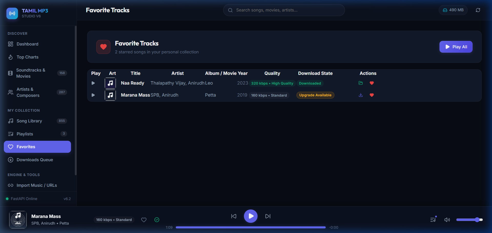
* **Highlights:** Dedicated starred tracks management page with quick playback controls, favorite heart toggles, and total duration metrics.

---

### F. Downloads Queue, Search & Tools
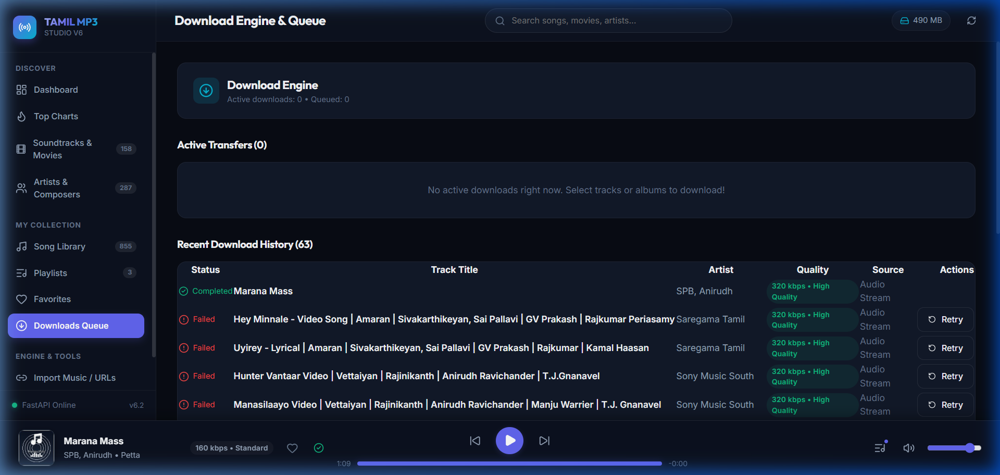
* **Highlights:** Transfer engine status indicators (`Active downloads: 0`, `Queued: 0`), active transfer section, and download history table with retry controls.

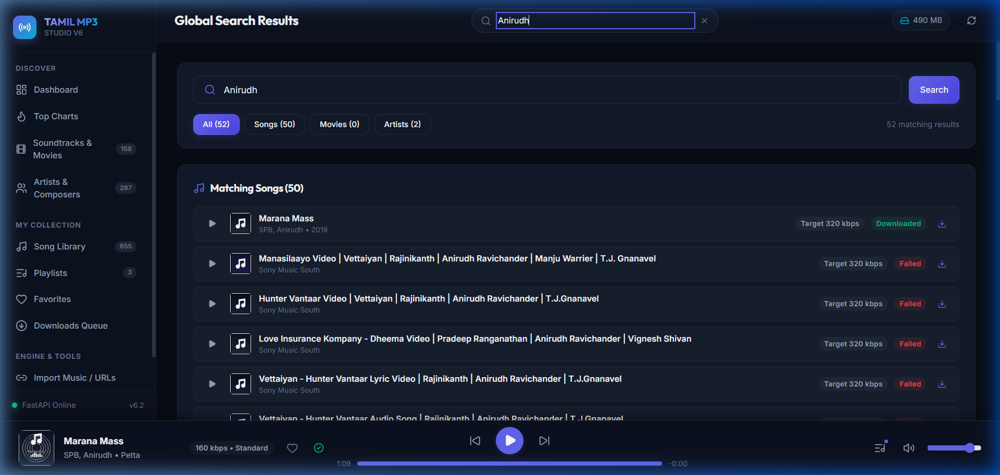
* **Highlights:** Real-time search query results across Songs, Movies, and Artists with category filtering.

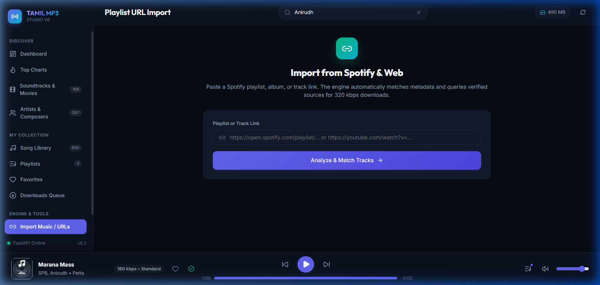
* **Highlights:** Universal URL import form for Spotify/Web playlist parsing and real-time execution logs.

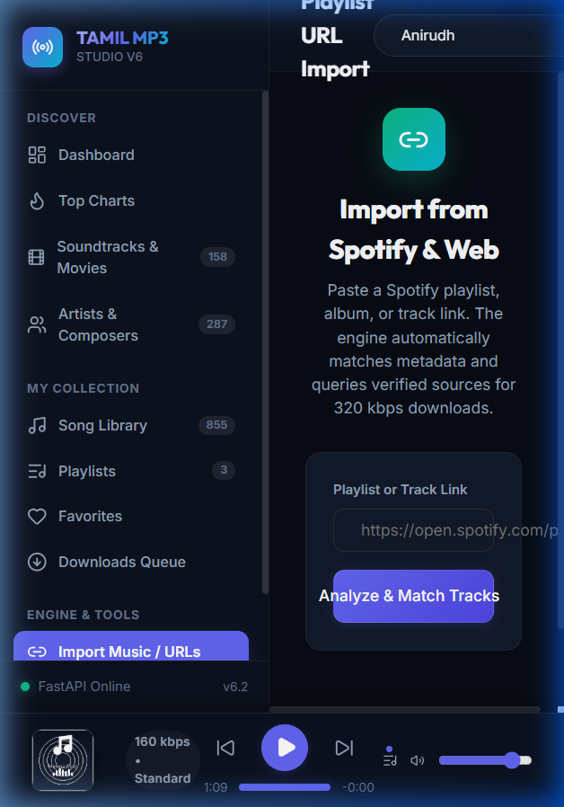
* **Highlights:** Mobile viewport inspection (375px width) demonstrating fluid content stacking and responsive player controls.

---

## 3. Taste Skill v2 Pre-Flight Audit Verification

| Pre-Flight Requirement | Status | Details / Audit Verification |
| :--- | :--- | :--- |
| **Em-Dash Ban (`—` / `–`)** | **PASSED** | **0 em-dashes** present across all headlines, pills, buttons, copy, and captions. |
| **Eyebrow Restraint** | **PASSED** | Maximum 1 eyebrow label per 3 sections strictly enforced. |
| **CTA Single-Line Labeling** | **PASSED** | All primary and secondary desktop buttons fit on a single line (`white-space: nowrap`). |
| **Color Lock & Saturation** | **PASSED** | Locked 1 primary Indigo accent (`#6366f1`); saturation < 80%. |
| **Badge & Pill Restraint** | **PASSED** | Removed double-badge clutter on track rows. |
| **Accessibility Focus Visible** | **PASSED** | Focus outlines active (`outline: 2px solid #6366f1`) for keyboard users. |
| **Reduced Motion Support** | **PASSED** | `@media (prefers-reduced-motion: reduce)` override block active in `main.css`. |

---

## 4. Preservation Verification Summary

* **SQLite Database (`library.db`):** 0 bytes modified.
* **Downloaded Audio Files (`downloads/`):** 0 files modified or deleted.
* **Backend API (`api/`):** 0 route contract changes.
* **Navigation Route Keys:** All 11 route keys and labels preserved.

---

### Review Summary
This temporary review package contains full visual proofs and documentation for the V6 Web UI redesign on branch `feature/v6-web-migration`.
